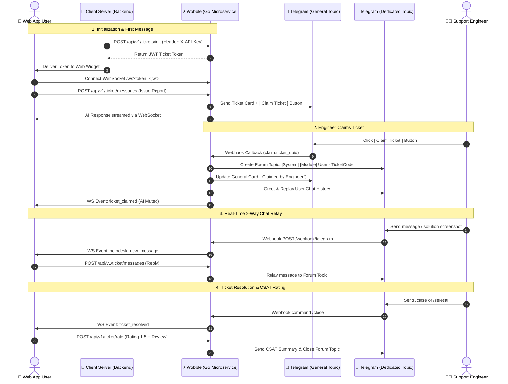

# Wobble — Universal Multi-Tenant Helpdesk, AI Gateway & Telegram Relay

Wobble is a high-performance, multi-tenant helpdesk gateway built with **Go (Golang)**, **GORM**, **PostgreSQL**, and **Gorilla WebSocket**. It bridges web-based client applications (SaaS, ERP, SIMRS, e-Commerce) with **Telegram Forum Topics** for support teams, while utilizing an **AI Assistant** as a fast first-responder.

---

## 1. Features & Highlights

- **Lightweight & High Performance**: Powered by Go and PostgreSQL, handling thousands of concurrent WebSocket connections with low memory usage (~15–30 MB).
- **Universal Multi-Tenant with Zero Table Overhead on Clients**: Client systems interact via REST API and a lightweight client-side widget without needing local helpdesk tables.
- **Smart Hybrid Support Workflow (AI ➔ On-Demand Claim ➔ Telegram Relay)**:
  1. Initial issue reports post a notification card to the **General** Telegram supergroup with an interactive **`[ Claim Ticket ]`** button.
  2. Users on the web receive immediate assistance from an **AI Assistant** (LLM).
  3. When an engineer clicks **Claim Ticket**, a dedicated **Telegram Forum Topic** is automatically created for that ticket, the AI seamlessly mutes (*silent handoff*), and conversation history is replayed.
  4. Real-time, 2-way messaging (text, images, and videos) flows between the web user and the engineer in the forum topic.
- **Robust Security Architecture**:
  - **Server-to-Server Auth**: Tenants authenticate using API keys (`X-API-Key`), stored securely as SHA-256 hashes.
  - **Client Token Auth**: Browsers connect using short-lived JWT ticket tokens (`Authorization: Bearer <token>`).
  - **Signed Media URLs**: File attachments are verified using MIME sniffing and served through HMAC-signed URLs with expirations, preventing unauthorized file access.
  - **Webhook Verification**: Telegram webhooks strictly validate `X-Telegram-Bot-Api-Secret-Token` and deduplicate `update_id`s.

---

## 2. Architecture & Sequence Flow



---

## 3. Database Schema Overview

PostgreSQL 13+ schema managed via atomic migrations (`migrations/`):

1. **`tenants`**: Registered client applications/organizations, API key hash, origin whitelist, and active status.
2. **`tickets`**: Ticket metadata, status (`open`, `escalated`, `resolved`), assigned engineer, Telegram thread ID, CSAT rating, and activity timestamps.
3. **`messages`**: Chat logs, sender types (`user`, `ai`, `programmer`, `system`), attachment metadata, Telegram message synchronization, and idempotent `client_msg_id`.
4. **`telegram_updates`**: Webhook deduplication log to guarantee at-most-once processing.

---

## 4. API & WebSocket Specifications

### Server-to-Server Endpoints (Header `X-API-Key`)

| Method | Endpoint | Description |
| :--- | :--- | :--- |
| `POST` | `/api/v1/tickets/init` | Initialize or retrieve the active ticket for a user; returns JWT token. |

### Browser & Widget Endpoints (Header `Authorization: Bearer <token>`)

| Method | Endpoint | Description |
| :--- | :--- | :--- |
| `GET` | `/api/v1/ticket` | Fetch ticket details associated with current token. |
| `GET` | `/api/v1/ticket/messages` | Retrieve paginated message history (`?after_id=&limit=`). |
| `POST` | `/api/v1/ticket/messages` | Send user message (`202 Accepted`). |
| `POST` | `/api/v1/ticket/attachments` | Upload image/video attachment (multipart form). |
| `POST` | `/api/v1/ticket/resolve` | User-initiated ticket resolution. |
| `POST` | `/api/v1/ticket/rate` | Submit 1–5 CSAT rating and review (resolved tickets only). |
| `GET` | `/ws?token=<token>` | Real-time WebSocket connection. |

### Public & Integration Endpoints

| Method | Endpoint | Description |
| :--- | :--- | :--- |
| `GET` | `/files/:message_id?exp=&sig=` | Secure file download via HMAC-signed URL. |
| `POST` | `/webhook/telegram` | Telegram Bot webhook (requires `X-Telegram-Bot-Api-Secret-Token`). |
| `GET` | `/health` | Service liveness healthcheck. |
| `GET` | `/ready` | Service readiness check (database connectivity). |

---

## 5. WebSocket Event Formats

Payload structure: `{"event": "<event_name>", "data": { ... }}`

- `helpdesk_new_message`: New chat message (`MessageDTO`).
- `ai_typing`: AI typing indicator status (`{"typing": true|false}`).
- `ticket_claimed`: Notification that an engineer claimed the ticket (`{"programmer_name": "...", "status": "escalated"}`).
- `ticket_resolved`: Ticket completed notification (`{"status": "resolved"}`).

---

## 6. Getting Started

### Prerequisites
- **Go**: Version 1.22+
- **PostgreSQL**: Version 13+
- **golang-migrate**: For database migrations
- **Telegram Bot**: Created via `@BotFather` with admin privileges in a Supergroup (Topics enabled)

### Configuration
Copy the environment template and configure required settings:

```bash
cp .env.example .env
```

Key environment variables:
- `APP_ENV`: `development` or `production`
- `DATABASE_URL`: PostgreSQL connection string
- `TOKEN_SECRET`: 32+ character HMAC secret for ticket JWTs
- `FILE_SIGNING_SECRET`: Dedicated HMAC secret for generating & verifying signed media download URLs
- `TELEGRAM_BOT_TOKEN`: Bot token from BotFather
- `TELEGRAM_CHAT_ID`: Telegram Supergroup ID (typically `-100...`)
- `TELEGRAM_WEBHOOK_SECRET`: Secret token for webhook verification
- `AI_API_KEY`: OpenRouter / OpenAI API key (optional; AI mutes gracefully if empty)

### AI Privacy & Data Security
- **Data Boundary**: User messages sent through the widget may contain internal business or diagnostic context.
- **On-Premise Deployment**: Point `AI_ENDPOINT` to an in-house OpenAI-compatible LLM gateway (such as Ollama, vLLM, or LocalAI) to ensure zero third-party data egress.
- **Opt-Out**: Leave `AI_API_KEY` empty to completely disable external LLM processing. All incoming tickets will bypass AI and route directly to support engineers via Telegram.

### Database Migrations
Apply migrations using the provided script:

```bash
# Run all migrations up
./scripts/migrate.sh up

# Check migration version
./scripts/migrate.sh status
```

### Running the Service

```bash
# Run the API server
go run ./cmd/server

# Register a new tenant via CLI
go run ./cmd/tenantctl add --key tenant_acme_prod --app "Acme ERP" --name "Acme Corporation"
```

---

## 7. Client Integration Example

In your server backend (e.g., PHP, Node.js, Python, Go), request a ticket token using your tenant API Key:

```php
// Backend: Request Ticket Token
$ch = curl_init("https://helpdesk.yourdomain.com/api/v1/tickets/init");
curl_setopt($ch, CURLOPT_HTTPHEADER, [
    "Content-Type: application/json",
    "X-API-Key: " . $TENANT_API_KEY
]);
curl_setopt($ch, CURLOPT_POSTFIELDS, json_encode([
    "user_id"     => (string) $userId,
    "user_name"   => $userName,
    "module_name" => $currentModule,
    "diagnostic_info" => [
        "current_url" => $currentUrl,
        "browser"     => $_SERVER['HTTP_USER_AGENT'] ?? ''
    ]
]));
curl_setopt($ch, CURLOPT_RETURNTRANSFER, true);
$response = json_decode(curl_exec($ch), true);
$ticketToken = $response['token'];
```

Pass `$ticketToken` to the frontend view to initialize the web widget:

```html
<script>
  window.WobbleConfig = {
    gatewayUrl: "https://helpdesk.yourdomain.com",
    token: "<?= $ticketToken ?>"
  };
</script>
<script src="https://helpdesk.yourdomain.com/assets/widget.js" async></script>
```

---

## 8. License

[MIT](LICENSE)

